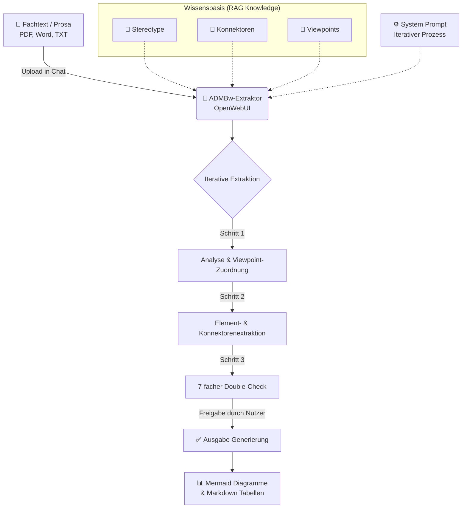

# 🚀 ADMBw-Extraktor (NAFv4)

Der **ADMBw-Extraktor** ist ein KI-gestützter Agent (maßgeschneidert für OpenWebUI), der architekturrelevante Fachtexte (Prosa) automatisch analysiert und in standardkonforme **ADMBw-NAFv4-Architekturmodelle** übersetzt. Er nutzt einen streng iterativen Prozess mit einem 7-fachen Double-Check, um höchste Modellierungsqualität und Regelkonformität zu garantieren.

---

## 🔄 Workflow & Funktionsweise

Der Extraktor bricht komplexe Dokumente strukturiert auf und generiert daraus im Chat direkt native Mermaid-Diagramme für die jeweiligen Architektur-Viewpoints.

---

## 📁 Repository-Struktur

| Datei | Beschreibung |
|-------|--------------|
| ⚙️ `system_prompt.md` | Steuert den iterativen Workflow, das Ausgabeverhalten und die Qualitätskontrolle des LLMs. |
| 🧠 `ADMBw-Knowledge-Stereotypes.md` | Enthält alle 317 Stereotype inklusive AppliesTo-Regeln und TaggedValues. |
| 🧠 `ADMBw-Knowledge-Viewpoints.md` | Metamodell-Regeln, die exakt festlegen, welche Elemente in welchem Viewpoint erlaubt sind. |
| 🧠 `ADMBw-Knowledge-Connectors.md` | Konnektor-Regeln, Abhängigkeiten und die vollständige Viewpoint-Liste. |
| 📚 `Dokumentation-ADMBw-v2025.10.pdf`| Die offizielle Dokumentation (als menschliche Referenz). |

---

## 🔧 Einrichtung in OpenWebUI (Dauer: ~3 Minuten)

### 1. Modell anlegen & System-Prompt konfigurieren
1. Erstelle im **Workspace** ein neues Modell (z.B. basierend auf GPT-4o, Claude 3.5 Sonnet oder DeepSeek).
2. Vergib einen Namen (z.B. `ADMBw-Prosa-Analyst`).
3. Kopiere den gesamten Inhalt der Datei `system_prompt.md` in das Feld **System Prompt**.

### 2. Knowledge-Dateien hinterlegen
1. Gehe in den Bereich **Knowledge** und lade die folgenden drei Dateien hoch:
   * `ADMBw-Knowledge-Stereotypes.md`
   * `ADMBw-Knowledge-Viewpoints.md`
   * `ADMBw-Knowledge-Connectors.md`
2. Verknüpfe diese Knowledge-Base mit deinem zuvor erstellten Modell.

*(Tipp: Die Original-PDF-Dokumentation muss nicht in die Knowledge-Base geladen werden. Die Markdown-Dateien bilden die gesamte Logik wesentlich token-effizienter und präziser für das LLM ab.)*

---

## 🛠 Nutzung im Alltag

1. Öffne einen Chat mit dem neuen ADMBw-Modell.
2. Lade ein Prosa-Dokument (z.B. Betriebskonzept, Fähigkeitsbeschreibung) hoch oder kopiere den Text in den Chat.
3. Die KI startet automatisch den **iterativen 4-Schritte-Prozess**:
   - **Schritt 1:** Identifikation und Zuordnung der Viewpoints.
   - **Schritt 2:** Detaillierte Extraktion der Elemente.
   - **Schritt 3:** Ausführung des Double-Check Reports (Regelkonformität).
   - **Schritt 4:** Finale Erzeugung der Mermaid-Diagramme.
4. **Wichtig:** Antworte zwischen den Schritten kurz (z.B. mit "Passt, weiter zu Schritt 2"), um den iterativen Flow aufrechtzuerhalten und Halluzinationen vorzubeugen.
