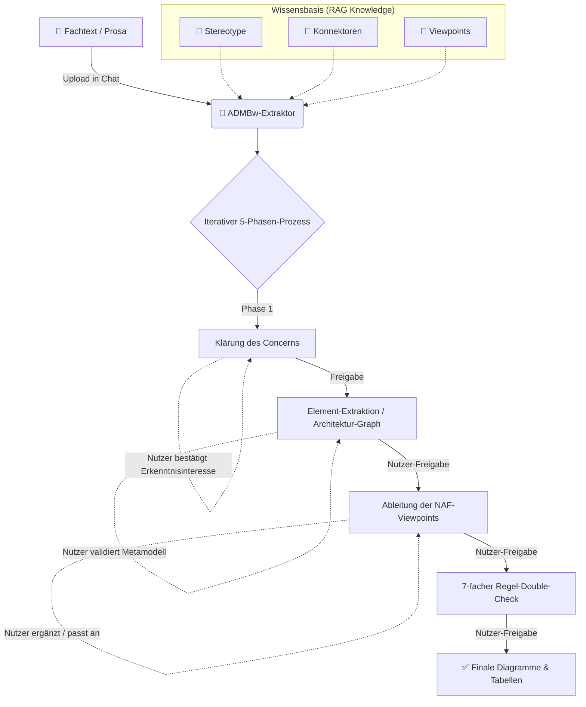

# 🚀 ADMBw-Extraktor (NAFv4)

Der **ADMBw-Extraktor** ist ein KI-gestützter Agent (maßgeschneidert für OpenWebUI), der architekturrelevante Fachtexte (Prosa) automatisch analysiert und in standardkonforme **ADMBw-NAFv4-Architekturmodelle** übersetzt. Er nutzt einen streng iterativen Prozess mit einem 7-fachen Double-Check, um höchste Modellierungsqualität und Regelkonformität zu garantieren.

### ⚠️ Wichtiger Hinweis zur Zielsetzung
Der **ADMBw-Extraktor** produziert bewusst **keine fertigen, importierbaren Architekturmodelle** (wie z.B. XMI). 

Er dient ausschließlich der **Vorbereitung der Modellierung**: Das Tool extrahiert architekturrelevante Informationen aus Prosa und stellt sie übersichtlich im Chat oder als HTML-Artefakt dar. Dieser Output dient dem Architekten als **strukturierte Vorlage zum Ablesen und manuellen Nachmodellieren** im eigentlichen Werkzeug (z.B. Sparx Enterprise Architect). Die ID-Vergabe und finale semantische Validierung erfolgen zwingend dort.

> 🔒 **Sicherheitshinweis:** Bitte zwingend auf den korrekten Umgang mit eingestuften Daten achten!

---

## 🧠 Das Kernkonzept: Warum ein iterativer Workflow?

Die ADMBw-NAFv4-Vorgaben sind hochkomplex (317 Stereotype, strikte Metamodell- und Konnektor-Regeln). Wenn eine KI versucht, ein ganzes Dokument in einem einzigen Zug in ein fertiges Architekturmodell zu verwandeln, kommt es unweigerlich zu Halluzinationen, übersehenen Details oder Regelverstößen.

Der ADMBw-Extraktor erzwingt daher einen **iterativen Step-by-Step-Ansatz**. Das bedeutet: Die KI arbeitet in Phasen und stoppt nach jeder Phase, um auf dein Feedback zu warten. **Du bist der Architekt (Gatekeeper), die KI ist dein Werkzeug.**

### Die 5 Phasen der Interaktion:

1. **Phase 1: Klärung des Erkenntnisinteresses (Concern)**
   Gemäß ISO/IEC 42010 startet alles mit dem "Concern". Die KI fragt dich aktiv, was genau du mit der Modellierung erreichen willst (falls du es nicht schon im ersten Prompt mitgegeben hast).
   *👉 Dein Part: Du bestätigst das formulierte Erkenntnisinteresse.*
2. **Phase 2: Metamodell-Extraktion (Architektur-Graph)**
   Die KI scannt den Text und extrahiert basierend auf dem freigegebenen Concern erst einmal völlig frei alle relevanten Elemente und Beziehungen. Es wird ein reiner Architektur-Graph (Semantisches Netz) erzeugt.
   *👉 Dein Part: Du kontrollierst dieses Netz. Fehlt ein System? Ist eine Abhängigkeit falsch? Korrigiere es, bevor überhaupt über Viewpoints geredet wird.*
3. **Phase 3: Viewpoint-Zuordnung**
   Aus dem freigegebenen Architektur-Netz leitet die KI nun zielgerichtet exakt jene NAF-Viewpoints ab, die den ursprünglichen Concern beantworten.
   *👉 Dein Part: Du bestätigst die ausgewählten Sichten auf dein Modell.*
4. **Phase 4: Der 7-fache Double-Check**
   Die KI prüft ihren Entwurf pro Viewpoint hart gegen die hinterlegte Knowledge-Base (AppliesTo-Regeln, Viewpoint-Zulässigkeit, etc.).
   *👉 Dein Part: Du sichtest den Fehler-Report und gibst das Go zur Fehlerbehebung.*
5. **Phase 5: Finale Generierung**
   Erst nach deiner finalen Freigabe werden die komplexen Mermaid-Diagramme und Markdown-Tabellen gerendert.

**Der Vorteil:** 100% Kontrolle über die Modellierung, 0% Halluzination, perfekt standardkonforme ADMBw-Modelle.

---

## 🔄 Workflow-Visualisierung

---

## 📁 Repository-Struktur

| Datei | Beschreibung |
|-------|--------------|
| ⚙️ `system_prompt.md` | Steuert den iterativen Workflow, das Ausgabeverhalten und die Qualitätskontrolle des LLMs. |
| 🧠 `ADMBw-Knowledge-Stereotypes.md` | Enthält alle 317 Stereotype inklusive AppliesTo-Regeln und TaggedValues. |
| 🧠 `ADMBw-Knowledge-Viewpoints.md` | Metamodell-Regeln, die exakt festlegen, welche Elemente in welchem Viewpoint erlaubt sind. |
| 🧠 `ADMBw-Knowledge-Connectors.md` | Konnektor-Regeln, Abhängigkeiten und die vollständige Viewpoint-Liste. |
| 📚 `Dokumentation-ADMBw-v2025.10.pdf`| Die offizielle Dokumentation (als menschliche Referenz). |

---

## 🔧 Einrichtung in OpenWebUI (Dauer: ~3 Minuten)

### 1. Modell anlegen & System-Prompt konfigurieren
1. Erstelle im **Workspace** ein neues Modell (z.B. basierend auf GPT-4o, Claude 3.5 Sonnet oder DeepSeek).
2. Vergib einen Namen (z.B. `ADMBw-Prosa-Analyst`).
3. Kopiere den gesamten Inhalt der Datei `system_prompt.md` in das Feld **System Prompt**.

### 2. Knowledge-Dateien hinterlegen
1. Gehe in den Bereich **Knowledge** und lade die folgenden drei Dateien hoch:
   * `ADMBw-Knowledge-Stereotypes.md`
   * `ADMBw-Knowledge-Viewpoints.md`
   * `ADMBw-Knowledge-Connectors.md`
2. Verknüpfe diese Knowledge-Base mit deinem zuvor erstellten Modell.

*(Tipp: Die Original-PDF-Dokumentation muss nicht in die Knowledge-Base geladen werden. Die Markdown-Dateien bilden die gesamte Logik wesentlich token-effizienter und präziser für das LLM ab.)*

---

## 🌐 Nutzung außerhalb von OpenWebUI (ChatGPT, Claude, etc.)

Du hast kein OpenWebUI zur Verfügung? Kein Problem. Der Extraktor funktioniert auch in klassischen KI-Chats, indem du die Dateien einfach direkt übergibst:

1. Lade die **vier Markdown-Dateien** (`system_prompt.md` sowie die drei `ADMBw-Knowledge-*.md` Dateien) als Dateianhang in deinen Chat hoch.
2. Lade dein **Fachtext-Dokument** hoch.
3. Schreibe als erste Nachricht: *"Bitte lies die angehängte Datei system_prompt.md als deine Kern-Anweisung und nutze die Knowledge-Dateien als Wissensbasis. Wende den dort beschriebenen Workflow auf mein Dokument an."*

---

## 🛠 Nutzung im Alltag

1. Öffne einen Chat mit dem neuen ADMBw-Modell.
2. Lade ein Prosa-Dokument hoch oder kopiere den Text in den Chat.
3. Die KI startet **Phase 1**.
4. Antworte auf jeden Schritt der KI kurz (z.B. *"Passt so, weiter zu Phase 2"* oder *"Füge bei den Capabilities noch 'Satellitenkommunikation' hinzu, dann weiter"*), bis die finalen Diagramme in Phase 4 generiert werden.
