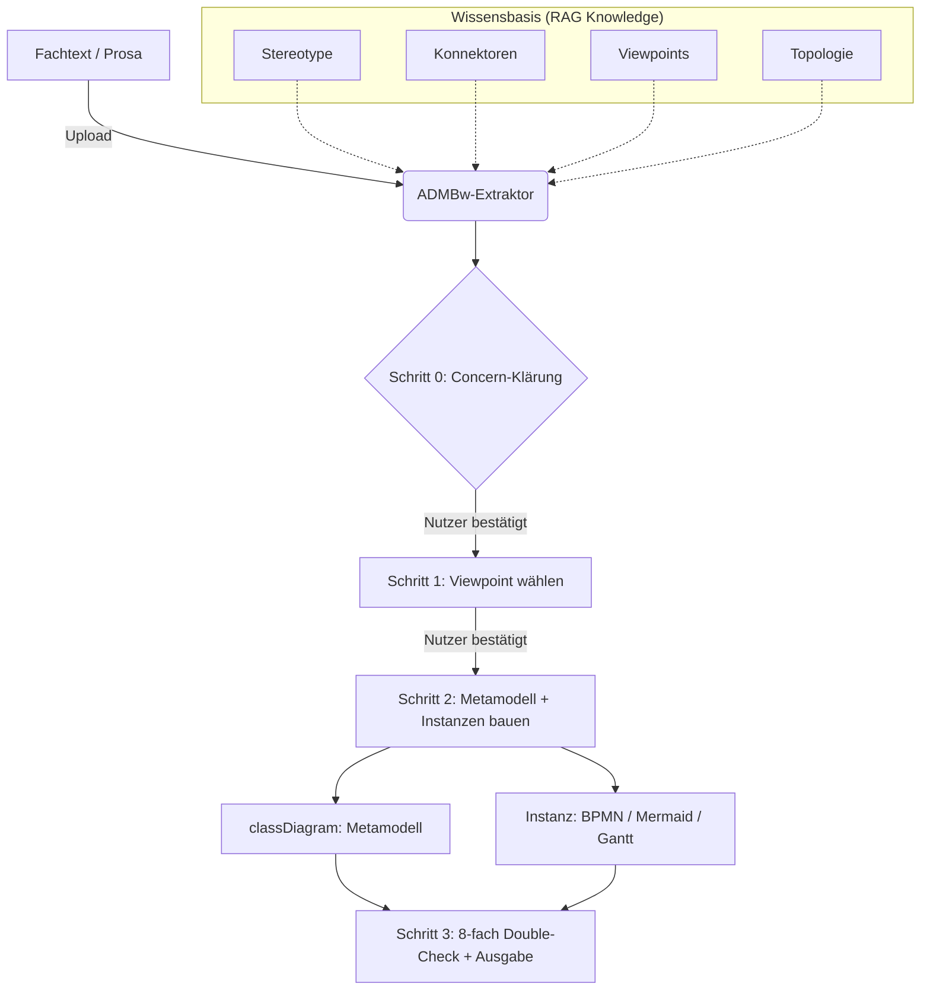

# ADMBw-Extraktor (v5.2 - Experimental)

Der **ADMBw-Extraktor** ist ein KI-gestützter Agent (OpenWebUI), der architekturrelevante Fachtexte analysiert und **pro Viewpoint ein vollständiges Metamodell-Diagramm** sowie ein Instanz-Diagramm generiert. Regelbasis: ADMBw-Dokumentation, NAFv4-MDG und Leitfaden FFFmLV.

### ⚠️ Hinweis zur Zielsetzung

Der Extraktor produziert **keine importierbaren Architekturmodelle** (kein XMI). Der Output dient als **strukturierte Modellierungshilfe** zum Ablesen und manuellen Nachmodellieren in Sparx EA. ID-Vergabe und finale semantische Validierung erfolgen zwingend im Modellierungswerkzeug.

> 🔒 **Sicherheitshinweis:** Keine eingestuften Daten an öffentliche Clouds senden. On-Premise-Pflicht für VS-NfD.

---

## Das Kernkonzept: Metamodell + Instanz pro Viewpoint

Die ADMBw-NAFv4-Vorgaben sind komplex (317 Stereotype, 53 Viewpoints, strikte Topologie-Regeln). Der Extraktor arbeitet in **4 Schritten** und erzeugt pro Viewpoint **zwei Diagrammtypen**:

| Diagramm | Typ | Zeigt |
|----------|-----|-------|
| **Metamodell** | `classDiagram` | Regelwerk: Welche TYPEN und Beziehungen sind im Viewpoint erlaubt? |
| **Instanz-Diagramm** | Variiert (siehe Matrix) | Konkrete Elemente aus dem Prosa-Text |

### Die 4 Schritte:

1. **Schritt 0: Concern-Klärung** — Erkenntnisinteresse erfragen + ADMBw-Metamodell-Entscheidung
2. **Schritt 1: Viewpoint wählen** — Aus Concern ableiten oder Nutzer nennt ihn direkt
3. **Schritt 2: Metamodell bauen** — Alle erlaubten Typen + Beziehungen aus der Knowledge-Base
4. **Schritt 3: Ausgabe** — Metamodell (classDiagram) + Instanz-Diagramm + 8-fach Double-Check

---

## Instanz-Diagrammtypen pro Viewpoint

Das Metamodell ist **immer** ein `classDiagram`. Das Instanz-Diagramm variiert:

| Typ | Anzahl | Viewpoints |
|-----|--------|------------|
| classDiagram | 10 | C1, C7, C8, S1, S7, L1, P1, A1, A8, R2 |
| graph TD | 10 | C2, C4, S2, S4, L2, L8, P2, P8, A2, A7, R3, R7 |
| graph LR | 7 | C6, S3, P3, L4-P4, C1-S1, A3, R8 |
| gantt | 6 | Cr, Sr, Lr, Pr, Ar, Rr |
| **BPMN 2.0** | **3** | **L4, P4, A4** (L4 per FFFmLV L4-MK08 zwingend) |
| stateDiagram | 4 | S5, L5, P5, A5 |
| sequenceDiagram | 4 | S6, L3, L6, P6 |
| timeline | 3 | C3, S8, A6 |
| erDiagram | 2 | L7, P7 |
| quadrantChart | 1 | C5 |

**BPMN-Views** nutzen bpmn-js für L4/P4/A4. BPMN-native Elemente (STARTEVENT, ENDEVENT, GATEWAY) sind im BPMN-2.0-Standard definiert und werden **zusätzlich** zu den ADMBw-Stereotypen verwendet.

---

## Workflow-Visualisierung

```mermaid
graph TD
    A[Fachtext / Prosa] -->|Upload| B(ADMBw-Extraktor)

    subgraph "Wissensbasis (RAG Knowledge)"
    C1[Stereotype]
    C2[Konnektoren]
    C3[Viewpoints]
    C4[Topologie]
    end

    C1 -.-> B
    C2 -.-> B
    C3 -.-> B
    C4 -.-> B

    B --> S0{Schritt 0: Concern-Klärung}
    S0 -->|Nutzer bestätigt| S1[Schritt 1: Viewpoint wählen]
    S1 -->|Nutzer bestätigt| S2[Schritt 2: Metamodell + Instanzen bauen]
    S2 --> S2a[classDiagram: Metamodell]
    S2 --> S2b[Instanz: BPMN / Mermaid / Gantt]
    S2a --> S3[Schritt 3: 8-fach Double-Check + Ausgabe]
    S2b --> S3
```

---

## Repository-Struktur

| Datei | Beschreibung |
|-------|--------------|
| ⚙️ `system_prompt.md` | Steuert Workflow, Diagrammtyp-Matrix, BPMN-Regeln, Qualitätskontrolle |
| 🧠 `ADMBw-Knowledge-Stereotypes.md` | 317 Stereotype mit AppliesTo und TaggedValues |
| 🧠 `ADMBw-Knowledge-Viewpoints.md` | Erlaubte Elemente pro Viewpoint |
| 🧠 `ADMBw-Knowledge-Connectors.md` | Konnektor-Regeln und EA-Metatyp-Mapping |
| 🧠 `ADMBw-Knowledge-Topology.md` | Source→Connector→Target aus MDG-Metaconstraints |
| 📚 `Dokumentation-ADMBw-v2025.10.pdf`| Offizielle ADMBw-Dokumentation (Referenz) |

---

## Einrichtung in OpenWebUI (~3 Minuten)

### 1. Modell anlegen
1. Neues Modell im Workspace erstellen
2. Namen vergeben (z.B. `ADMBw-Prosa-Analyst`)
3. Inhalt von `system_prompt.md` ins Feld **System Prompt** kopieren

### 2. Knowledge-Dateien hinterlegen
1. Im Bereich **Knowledge** diese vier Dateien hochladen:
   - `ADMBw-Knowledge-Stereotypes.md`
   - `ADMBw-Knowledge-Viewpoints.md`
   - `ADMBw-Knowledge-Connectors.md`
   - `ADMBw-Knowledge-Topology.md`
2. Knowledge-Base mit dem Modell verknüpfen

> **Tipp:** Die PDF nicht in die Knowledge laden. Die MD-Dateien sind token-effizienter.

---

## Nutzung außerhalb von OpenWebUI

1. Fünf MD-Dateien (`system_prompt.md` + 4 Knowledge-Dateien) als Anhang hochladen
2. Fachtext-Dokument hochladen
3. Erste Nachricht: *"Bitte lies system_prompt.md als Kern-Anweisung und nutze die Knowledge-Dateien als Wissensbasis."*

---

## Regelquellen

| Quelle | Version |
|--------|---------|
| ADMBw-Dokumentation | v2025.10 |
| NAFv4-ADMBw-MDG | v2025.10 |
| Leitfaden FFFmLV | v2.0 (17.04.2026) |

## 8-facher Double-Check

| # | Check | Quelle |
|---|-------|--------|
| 1 | AppliesTo-Validierung | Stereotypes.md |
| 2 | Viewpoint-Konformität | Viewpoints.md |
| 3 | Konnektor-Metatyp | Connectors.md |
| 4 | Metaconstraint-Prüfung | Topology.md |
| 5 | Vollständigkeit | Prosa-Text |
| 6 | Namenskonsistenz | Viewpoint-übergreifend |
| 7 | Metamodell-Vollständigkeit | Viewpoints + Topology |
| 8 | Topologie-Richtung | Topology.md |

---

## Autor

Michael Estel (mit KI-Agent)
