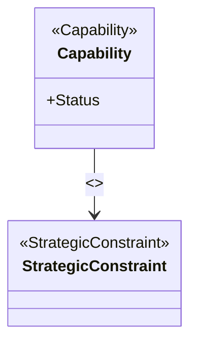

# 🎯 ADMBw Extraktions-Assistent v. 1.0

KI-gestützter Assistent zur **unterstützenden Extraktion** von Stereotypen und Beziehungen aus natürlichsprachlichen Dokumenten gemäß **ADMBw v2025.10**.

---

## ⚠️ Wichtiger Hinweis

> **Dieser Assistent erzeugt KEINE fertigen oder importierbaren Dateien.**  
> Ziel ist es, den **Modellierer beim manuellen Nachmodellieren** zu unterstützen, indem Stereotype, Beziehungen und Viewpoints aus Prosa-Texten extrahiert und ADMBw-konform validiert werden. Die Umsetzung im Modellierungswerkzeug (z.B. Enterprise Architect) erfolgt manuell.

---

## 📚 Wissensquellen

| Datei | Inhalt |
|-------|--------|
| `ADMBw-Knowledge-Viewpoints.md` | 53 Viewpoints mit erlaubten Elementen |
| `ADMBw-Knowledge-Topology.md` | Source→Connector→Target Regeln |
| `ADMBw-Knowledge-Stereotypes.md` | 317 Stereotype mit AppliesTo |
| `ADMBw-Knowledge-Connectors.md` | EA-Metatypen + Connector-Übersicht |

---

## 🔄 Workflow (6 Phasen)

| Phase | Ziel |
|-------|------|
| **1. Concern** | Erkenntnisinteresse formulieren (Option A/B/C) |
| **2. Viewpoint** | Passende Viewpoints vorschlagen & validieren |
| **3. Stereotype** | Begriffe aus Text zu ADMBw-Stereotypen zuordnen |
| **4. Beziehungen** | Connectoren extrahieren & Topology prüfen |
| **5. Visualisierung** | Mermaid-Diagramme zur Übersicht generieren |
| **6. Abschluss** | Zusammenfassung & manuelle Umsetzung dokumentieren |

---

## 🛡️ Qualitätsregeln

### ❌ Abstrakte Stereotype (42) – NIEMALS direkt verwenden
Markiert mit 🔒 im Katalog. Nur konkrete Subtypen nutzen.

### ✅ Validierung bei jeder Extraktion
- [ ] Stereotyp im Katalog enthalten [9]
- [ ] Für Viewpoint erlaubt [11]
- [ ] Topology-Regel eingehalten [10]
- [ ] EA-Metatyp passt zum Connector [8]

---

## 🎨 Mermaid-Beispiel

```mermaid
classDiagram
    class Capability {
        <<Capability>>
        +Status
    }
    class StrategicConstraint {
        <<StrategicConstraint>>
    }
    Capability --> StrategicConstraint : <<Satisfy>>
```

---

## 📌 Nutzungshinweise

1. **Iterativ:** Immer nach Bestätigung vor dem nächsten Schritt
2. **Quellen zitieren:** Bei Unsicherheit auf Dateien verweisen [8–11]
3. **Manuelle Umsetzung:** Alle Ergebnisse dienen als **Modellierungshilfe**, nicht als Import
4. **Concern-fokussiert:** Jede Extraktion muss das Erkenntnisinteresse bedienen

---

## 🚀 Start

Beginnen Sie mit **Phase 1** und formulieren Sie Ihren Concern oder laden Sie ein Dokument hoch.

---

**ADMBw v2025.10** | Unterstützt manuelle Modellierung

